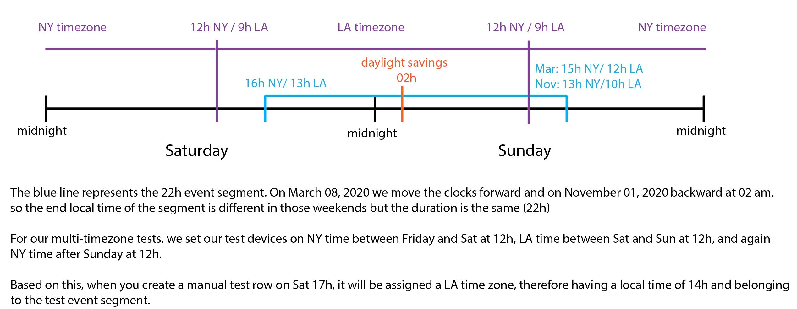

# Testing

The following is a simple guide to run RAPIDS' tests. All files necessary for testing are stored in the `./tests/` directory

## Steps for Testing

??? check "**Testing Overview**"
    1. You have to create a single four day test dataset for the sensor you are working on. 
    2. You will adjust your dataset with `tests/script/assign_test_timestamps.py` to fit `Fri March 6th 2020 - Mon March 9th 2020` and `Fri Oct 30th 2020 - Mon Nov 2nd 2020`. We test daylight saving times with these dates.
    2. We have one test participant per platform (`pids`: `android`, `ios`, `fitbit`, `empatica`, `empty`). The data `device_id` should be equal to the `pid`.
    2. We will run this test dataset against six test pipelines, three for `frequency`, `periodic`, and `event` time segments in a `single` time zone, and the same three in `multiple` time zones.
    3. You will have to create your test data to cover as many corner cases as possible. These cases depend on the sensor you are working on.
    4. The time segments and time zones to be tested are:

    ??? example "Frequency"
        - 30 minutes (`30min,30`)

    ??? example "Periodic"
        - morning (`morning,06:00:00,5H 59M 59S,every_day,0`)
        - daily (`daily,00:00:00,23H 59M 59S,every_day,0`)
        - three-day segments that repeat every day (`threeday,00:00:00,71H 59M 59S,every_day,0`)
        - three-day segments that repeat every Friday (`weekend,00:00:00,71H 59M 59S,wday,5`)

    ??? example "Event"
        - A segment that starts 3 hour before an event (Sat Mar 07 2020 19:00:00 EST) and lasts for 22 hours. Note that the last part of this segment will happen during a daylight saving change on Sunday at 2am when the clock moves forward and the period 2am-3am does not exist. In this case, the segment would start on Sat Mar 07 2020 16:00:00 EST (timestamp: 1583614800000) and end on Sun Mar 08 2020 15:00:00 EST (timestamp: 1583694000000). (`beforeMarchEvent,1583625600000,22H,3H,-1,android`)
        - A segment that starts 3 hour before an event (Sat Oct 31 2020 19:00:00 EST) and lasts for 22 hours. Note that the last part of this segment will happen during a daylight saving change on Sunday at 2am when the clock moves back and the period 1am-2am exists twice. In this case, the segment would start on Sat Oct 31 2020 16:00:00 EST (timestamp: 1604174400000) and end on Sun Nov 01 2020 13:00:00 EST (timestamp: 1604253600000). (`beforeNovemberEvent,1604185200000,22H,3H,-1,android`)

    ??? example "Single time zone to test"
        America/New_York

    ??? example "Multi time zones to test"
        - America/New_York starting at `0`
        - America/Los_Angeles starting at `1583600400000` (Sat Mar 07 2020 12:00:00 EST)
        - America/New_York starting at `1583683200000` (Sun Mar 08 2020 12:00:00 EST)
        - America/Los_Angeles starting at `1604160000000` (Sat Oct 31 2020 12:00:00 EST)
        - America/New_York starting at `1604250000000` (Sun Nov 01 2020 12:00:00 EST)
    
    ??? hint "Understanding event segments with multi timezones"
        <figure>
            
        </figure>

??? check "**Document your tests**"

    - Before you start implementing any test data you need to document your tests. 
    - The documentation of your tests should be added to `docs/developers/test-cases.md` under the corresponding sensor. 
    - You will need to add two subsections `Description` and the `Checklist`
    - The amount of data you need depends on each sensor but you can be efficient by creating data that covers corner cases in more than one time segment. For example, a battery episode from 11am to 1pm, covers the case when an episode has to be split for 30min frequency segments and for morning segments.
    - As a rule of thumb think about corner cases for 30min segments as they will give you the most flexibility.
    - Only add tests for iOS if the raw data format is different than Android's (for example for screen)
    - Create specific tests for Sunday before and after 02:00. These will test daylight saving switches, in March 02:00 to 02:59 do not exist, and in November 01:00 to 01:59 exist twice (read below how `tests/script/assign_test_timestamps.py` handles this)


    ??? example "Example of Description"
        `Description` is a list and every item describes the different scenarios your test data is covering. For example, if we are testing PHONE_BATTERY:

        ```
        - We test 24 discharge episodes, 24 charge episodes and 2 episodes with a 0 discharge rate
        - One episode is shorter than 30 minutes (`start timestamp` to `end timestamp`)
        - One episode is 120 minutes long from 11:00 to 13:00 (`start timestamp` to `end timestamp`). This one covers the case when an episode has to be chunked for 30min frequency segments and for morning segments
        - One episode is 60 minutes long from 23:30 to 00:30 (`start timestamp` to `end timestamp`). This one covers the case when an episode has to be chunked for 30min frequency segments and for daly segments (overnight)
        - One 0 discharge rate episode 10 minutes long that happens within a 30-minute segment (10:00 to 10:29) (`start timestamp` to `end timestamp`)
        - Three discharge episodes that happen between during beforeMarchEvent (start/end timestamps of those discharge episodes)
        - Three charge episodes that happen between during beforeMarchEvent (start/end timestamps of those charge episodes)
        - One discharge episode that happen between 00:30 and 04:00 to test for daylight saving times in March and Novemeber 2020.
        - ... any other test corner cases you can think of
        ```

        Describe your test cases in as much detail as possible so in the future if we find a bug in RAPIDS, we know what test case we did not include and should add.

    
    ??? example "Example of Checklist"
        `Checklist` is a table where you confirm you have verified the output of your dataset for the different time segments and time zones

        |time segment| single tz | multi tz|platform|
        |-|-|-|-|
        |30min|OK|OK|android and iOS|
        |morning|OK|OK|android and iOS|
        |daily|OK|OK|android and iOS|
        |threeday|OK|OK|android and iOS|
        |weekend|OK|OK|android and iOS|
        |beforeMarchEvent|OK|OK|android and iOS|
        |beforeNovemberEvent|OK|OK|android and iOS|


??? check "**Add raw input data.**"
    1. Add the raw test data to the corresponding sensor CSV file in `tests/data/manual/aware_csv/SENSOR_raw.csv`. Create the CSV if it does not exist.
    2. The test data you create will have the same columns as normal raw data except `test_time` replaces `timestamp`. To make your life easier, you can place a test data row in time using the `test_time` column with the following format: `Day HH:MM:SS.XXX`, for example `Fri 22:54:30.597`.
    2. You can convert your manual test data to actual raw test data with the following commands:
        
        - For the selected files: (It could be a single file name or multiple file names separated by whitespace(s))
            ```
            python tests/scripts/assign_test_timestamps.py -f file_name_1 file_name_2
            ```

        - For all files under the `tests/data/manual/aware_csv` folder: 
            ```
            python tests/scripts/assign_test_timestamps.py -a
            ```
    
    2. The script `assign_test_timestamps.py` converts you `test_time` column into a `timestamp`. For example, `Fri 22:54:30.597` is converted to `1583553270597` (`Fri Mar 06 2020 22:54:30 GMT-0500`) and to `1604112870597` (`Fri Oct 30 2020 22:54:30 GMT-0400`). Note you can include milliseconds.
    2. The `device_id` should be the same as `pid`.

    ??? example "Example of test data you need to create"
        The `test_time` column will be automatically converted to a timestamp that fits our testing periods in March and November by `tests/script/assign_test_timestamps.py`

        ```
        test_time,device_id,battery_level,battery_scale,battery_status
        Fri 01:00:00.000,ios,90,100,4
        Fri 01:00:30.500,ios,89,100,4
        Fri 01:01:00.000,ios,80,100,4
        Fri 01:01:45.500,ios,79,100,4
        ...
        Sat 08:00:00.000,ios,78,100,4
        Sat 08:01:00.000,ios,50,100,4
        Sat 08:02:00.000,ios,49,100,4
        ```

??? check "**Add expected output data.**"
    1. Add or update the expected output feature file of the participant and sensor you are testing:
    ```bash
    tests/data/processed/features/{type_of_time_segment}/{pid}/device_sensor.csv 
    
    # this example is expected output data for battery tests for periodic segments in a single timezone
    tests/data/processed/features/stz_periodic/android/phone_sensor.csv 

    # this example is expected output data for battery tests for periodic segments in multi timezones
    tests/data/processed/features/mtz_periodic/android/phone_sensor.csv 
    ```

??? check "**Edit the config file(s).**"
    1. Activate the sensor provider you are testing if it isn't already. Set `[SENSOR][PROVIDER][COMPUTE]` to `TRUE` in the `config.yaml` of the time segments and time zones you are testing:
    ```yaml
    - tests/settings/stz_frequency_config.yaml # For single-timezone frequency time segments
    - tests/settings/stz_periodic_config.yaml # For single-timezone periodic time segments
    - tests/settings/stz_event_config.yaml # For single-timezone event time segments

    - tests/settings/mtz_frequency_config.yaml # For multi-timezone frequency time segments
    - tests/settings/mtz_periodic_config.yaml # For multi-timezone periodic time segments
    - tests/settings/mtz_event_config.yaml # For multi-timezone event time segments
    ```
??? check "**Run the pipeline and tests.**"
    1. You can run all six segment pipelines and their tests
    ```bash
    bash tests/scripts/run_tests.sh -t all
    ```
    2. You can run only the pipeline of a specific time segment and its tests
    ```bash
    bash tests/scripts/run_tests.sh -t stz_frequency -a both # swap stz_frequency for mtz_frequency, stz_event, mtz_event, etc
    ```
    2. Or, if you are working on your tests and you want to run a pipeline and its tests independently
    ```bash
    bash tests/scripts/run_tests.sh -t stz_frequency -a run
    bash tests/scripts/run_tests.sh -t stz_frequency -a test
    ```

    ??? hint "How does the test execution work?"
        This bash script `tests/scripts/run_tests.sh` executes one or all test pipelines for different time segment types (`frequency`, `periodic`, and `events`) and single or multiple timezones.

        The python script `tests/scripts/run_tests.py` runs the tests. It parses the involved participants and active sensor providers in the `config.yaml` file of the time segment type and time zone being tested. We test that the output file we expect exists and that its content matches the expected values.

    ??? example "Output Example"
        The following is a snippet of the output you should see after running your test.

        ```bash
        test_sensors_files_exist (test_sensor_features.TestSensorFeatures) ... stz_periodic
        ok
        test_sensors_features_calculations (test_sensor_features.TestSensorFeatures) ... stz_periodic
        ok

        test_sensors_files_exist (test_sensor_features.TestSensorFeatures) ... stz_frequency
        ok
        test_sensors_features_calculations (test_sensor_features.TestSensorFeatures) ... stz_frequency
        FAIL
        ```

        The results above show that the for stz_periodic, both `test_sensors_files_exist` and `test_sensors_features_calculations` passed. While for stz_frequency, the first test `test_sensors_files_exist` passed while `test_sensors_features_calculations` failed. Additionally, you should get the traceback of the failure (not shown here).
