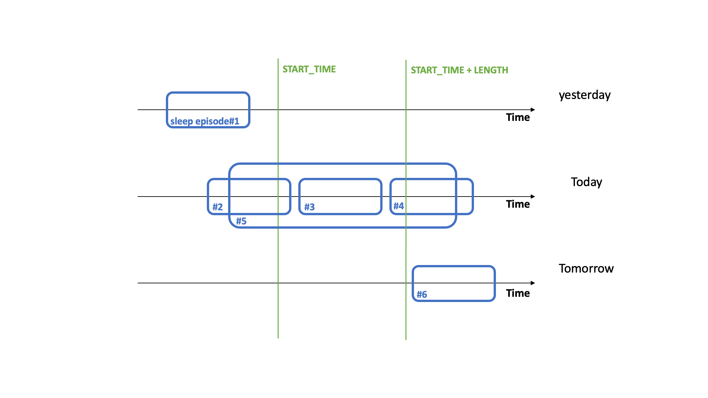

# Fitbit Sleep Intraday

Sensor parameters description for `[FITBIT_SLEEP_INTRADAY]`:

|Key&nbsp;&nbsp;&nbsp;&nbsp;&nbsp;&nbsp;&nbsp;&nbsp;&nbsp;&nbsp;&nbsp;&nbsp;&nbsp;&nbsp;&nbsp;&nbsp;&nbsp;&nbsp;&nbsp;&nbsp;&nbsp;&nbsp;&nbsp;&nbsp;&nbsp;&nbsp;&nbsp;&nbsp;&nbsp;            | Description |
|----------------|-----------------------------------------------------------------------------------------------------------------------------------
|`[CONTAINER]`| Container where your sleep intraday data is stored, depending on the data stream you are using this can be a database table, a CSV file, etc. |

## RAPIDS provider

!!! info "Available time segments"
    - Available for all time segments

!!! info "File Sequence"
    ```bash
    - data/raw/{pid}/fitbit_sleep_intraday_raw.csv
    - data/raw/{pid}/fitbit_sleep_intraday_with_datetime.csv
    - data/interim/{pid}/fitbit_sleep_intraday_episodes.csv
    - data/interim/{pid}/fitbit_sleep_intraday_episodes_resampled.csv
    - data/interim/{pid}/fitbit_sleep_intraday_episodes_resampled_with_datetime.csv
    - data/interim/{pid}/fitbit_sleep_intraday_features/fitbit_sleep_intraday_{language}_{provider_key}.csv
    - data/processed/features/{pid}/fitbit_sleep_intraday.csv
    ```


Parameters description for `[FITBIT_SLEEP_INTRADAY][PROVIDERS][RAPIDS]`:

|Key&nbsp;&nbsp;&nbsp;&nbsp;&nbsp;&nbsp;&nbsp;&nbsp;&nbsp;&nbsp;&nbsp;&nbsp;&nbsp;&nbsp;&nbsp;&nbsp;&nbsp;&nbsp;&nbsp;&nbsp;&nbsp;&nbsp;&nbsp;&nbsp;&nbsp;&nbsp;&nbsp;&nbsp;&nbsp;            | Description |
|----------------|-----------------------------------------------------------------------------------------------------------------------------------
|`[COMPUTE]`                                  | Set to `True` to extract `FITBIT_SLEEP_INTRADAY` features from the `RAPIDS` provider|
|`[FEATURES]`                                 |         Features to be computed from sleep intraday data, see table below           |
|`[SLEEP_LEVELS]`                             | Fitbit’s sleep API Version 1 only provides `CLASSIC` records. However, Version 1.2 provides 2 types of records: `CLASSIC` and `STAGES`. `STAGES` is only available in devices with a heart rate sensor and even those devices will fail to report it if the battery is low or the device is not tight enough. While `CLASSIC` contains 3 sleep levels (`awake`, `restless`, and `asleep`), `STAGES` contains 4 sleep levels (`wake`, `deep`, `light`, `rem`). To make it consistent, RAPIDS grouped them into 2 `UNIFIED` sleep levels: `awake` (`CLASSIC`: `awake` and `restless`; `STAGES`: `wake`) and `asleep` (`CLASSIC`: `asleep`; `STAGES`: `deep`, `light`, and `rem`).
|`[SLEEP_TYPES]`                              | Types of sleep to be included in the feature extraction computation. Fitbit provides 2 types of sleep: `main`, `nap`.
|`[INCLUDE_SLEEP_LATER_THAN]`| All resampled sleep rows (bin interval: one minute) that started after this time will be included in the feature computation. It is a number ranging from 0 (midnight) to 1439 (23:59) which denotes the number of minutes after midnight. If a segment is longer than one day, this value is for every day.
|`[REFERENCE_TIME]`| The reference point from which the `[ROUTINE]` features are to be computed. Chosen from `MIDNIGHT` and `START_OF_THE_SEGMENT`, default is `MIDNIGHT`. If you have multiple time segments per day it might be more informative to set this flag to `START_OF_THE_SEGMENT`.


Features description for `[FITBIT_SLEEP_INTRADAY][PROVIDERS][RAPIDS][LEVELS_AND_TYPES]`:

|Feature&nbsp;&nbsp;&nbsp;&nbsp;&nbsp;&nbsp;&nbsp;&nbsp;&nbsp;&nbsp;&nbsp;&nbsp;&nbsp;&nbsp;&nbsp;&nbsp;&nbsp;&nbsp;&nbsp;&nbsp;&nbsp;&nbsp;&nbsp;&nbsp;&nbsp;&nbsp;&nbsp;&nbsp;&nbsp;&nbsp;&nbsp;&nbsp;&nbsp;&nbsp;&nbsp;&nbsp;&nbsp;&nbsp;&nbsp;&nbsp;&nbsp;&nbsp;                    |Units          |Description                                                  |
|------------------------------- |-------------- |-------------------------------------------------------------|
|countepisode`[LEVEL][TYPE]`     |episodes       |Number of `[LEVEL][TYPE]`sleep episodes. `[LEVEL]`is one of `[SLEEP_LEVELS]` (e.g. awake-classic or rem-stages) and `[TYPE]` is one of `[SLEEP_TYPES]` (e.g. main). Both `[LEVEL]`and `[TYPE]` can also be `all` when ``LEVELS_AND_TYPES_COMBINING_ALL`` is True, which ignores the levels and groups by sleep types.
|sumduration`[LEVEL][TYPE]`      |minutes        |Total duration of all `[LEVEL][TYPE]`sleep episodes. `[LEVEL]`is one of `[SLEEP_LEVELS]` (e.g. awake-classic or rem-stages) and `[TYPE]` is one of `[SLEEP_TYPES]` (e.g. main). Both `[LEVEL]` and `[TYPE]`can also be `all` when `LEVELS_AND_TYPES_COMBINING_ALL` is True, which ignores the levels and groups by sleep types.
|maxduration`[LEVEL][TYPE]`      |minutes        | Longest duration of any `[LEVEL][TYPE]`sleep episode. `[LEVEL]`is one of `[SLEEP_LEVELS]` (e.g. awake-classic or rem-stages) and `[TYPE]` is one of `[SLEEP_TYPES]` (e.g. main). Both `[LEVEL]` and `[TYPE]`can also be `all` when `LEVELS_AND_TYPES_COMBINING_ALL` is True, which ignores the levels and groups by sleep types.
|minduration`[LEVEL][TYPE]`      |minutes        | Shortest duration of any `[LEVEL][TYPE]`sleep episode. `[LEVEL]`is one of `[SLEEP_LEVELS]` (e.g. awake-classic or rem-stages) and `[TYPE]` is one of `[SLEEP_TYPES]` (e.g. main). Both `[LEVEL]` and `[TYPE]`can also be `all` when `LEVELS_AND_TYPES_COMBINING_ALL` is True, which ignores the levels and groups by sleep types.
|avgduration`[LEVEL][TYPE]`      |minutes        | Average duration of all `[LEVEL][TYPE]`sleep episodes. `[LEVEL]`is one of `[SLEEP_LEVELS]` (e.g. awake-classic or rem-stages) and `[TYPE]` is one of `[SLEEP_TYPES]` (e.g. main). Both `[LEVEL]` and `[TYPE]`can also be `all` when `LEVELS_AND_TYPES_COMBINING_ALL` is True, which ignores the levels and groups by sleep types.
|medianduration`[LEVEL][TYPE]`   |minutes        | Median duration of all `[LEVEL][TYPE]`sleep episodes. `[LEVEL]`is one of `[SLEEP_LEVELS]` (e.g. awake-classic or rem-stages) and `[TYPE]` is one of `[SLEEP_TYPES]` (e.g. main). Both `[LEVEL]` and `[TYPE]`can also be `all` when `LEVELS_AND_TYPES_COMBINING_ALL` is True, which ignores the levels and groups by sleep types.
|stdduration`[LEVEL][TYPE]`      |minutes        | Standard deviation duration of all `[LEVEL][TYPE]`sleep episodes. `[LEVEL]`is one of `[SLEEP_LEVELS]` (e.g. awake-classic or rem-stages) and `[TYPE]` is one of `[SLEEP_TYPES]` (e.g. main). Both `[LEVEL]` and `[TYPE]`can also be `all` when `LEVELS_AND_TYPES_COMBINING_ALL` is True, which ignores the levels and groups by sleep types.


Features description for `[FITBIT_SLEEP_INTRADAY][PROVIDERS][RAPIDS]` RATIOS `[ACROSS_LEVELS]`:

|Feature&nbsp;&nbsp;&nbsp;&nbsp;&nbsp;&nbsp;&nbsp;&nbsp;&nbsp;&nbsp;&nbsp;&nbsp;&nbsp;&nbsp;&nbsp;&nbsp;&nbsp;&nbsp;&nbsp;&nbsp;&nbsp;&nbsp;&nbsp;&nbsp;&nbsp;&nbsp;&nbsp;                    |Units |Description                                                        |
|-------------------------- |-------------- |-------------------------------------------------------------|
|ratiocount`[LEVEL]`         |-|Ratio between the **count** of episodes of a single sleep `[LEVEL]` and the **count** of all episodes of all levels during both `main` and `nap` sleep types. This answers the question: what percentage of all `wake`, `deep`, `light`, and `rem` episodes were `rem`? (e.g., $countepisode[remstages][all] / countepisode[all][all]$)
|ratioduration`[LEVEL]`      |-|Ratio between the **duration** of episodes of a single sleep `[LEVEL]` and the **duration** of all episodes of all levels during both `main` and `nap` sleep types. This answers the question: what percentage of all `wake`, `deep`, `light`, and `rem` time was `rem`? (e.g., $sumduration[remstages][all] / sumduration[all][all]$)


Features description for `[FITBIT_SLEEP_INTRADAY][PROVIDERS][RAPIDS]` RATIOS `[ACROSS_TYPES]`:

|Feature&nbsp;&nbsp;&nbsp;&nbsp;&nbsp;&nbsp;&nbsp;&nbsp;&nbsp;&nbsp;&nbsp;&nbsp;&nbsp;&nbsp;&nbsp;&nbsp;&nbsp;&nbsp;&nbsp;&nbsp;&nbsp;&nbsp;&nbsp;&nbsp;&nbsp;&nbsp;&nbsp;                    |Units          |Description                                                  |
|-------------------------- |-------------- |-------------------------------------------------------------|
|ratiocountmain             |-              |Ratio between the **count** of all `main` episodes (independently of the levels inside) divided by the **count** of all `main` and `nap` episodes. This answers the question: what percentage of all sleep episodes (`main` and `nap`) were `main`? We do not provide the ratio for `nap` because is complementary. ($countepisode[all][main] / countepisode[all][all]$)
|ratiodurationmain          |-              |Ratio between the **duration** of all `main` episodes (independently of the levels inside) divided by the **duration** of all `main` and `nap` episodes. This answers the question: what percentage of all sleep time (`main` and `nap`) was `main`? We do not provide the ratio for `nap` because is complementary. ($sumduration[all][main] / sumduration[all][all]$)


Features description for `[FITBIT_SLEEP_INTRADAY][PROVIDERS][RAPIDS]` RATIOS `[WITHIN_LEVELS]`:

|Feature&nbsp;&nbsp;&nbsp;&nbsp;&nbsp;&nbsp;&nbsp;&nbsp;&nbsp;&nbsp;&nbsp;&nbsp;&nbsp;&nbsp;&nbsp;&nbsp;&nbsp;&nbsp;&nbsp;&nbsp;&nbsp;&nbsp;&nbsp;&nbsp;&nbsp;&nbsp;&nbsp;                           |Units          |Description                                                  |
|--------------------------------- |-------------- |-------------------------------------------------------------|
|ratiocount`[TYPE]`within`[LEVEL]`    |-              |Ratio between the **count** of episodes of a single sleep `[LEVEL]` during `main` sleep divided by the **count** of episodes of a single sleep `[LEVEL]` during `main` **and** `nap`. This answers the question: are `rem` episodes more frequent during `main` than `nap` sleep? We do not provide the ratio for `nap` because is complementary. ($countepisode[remstages][main] / countepisode[remstages][all]$)
|ratioduration`[TYPE]`within`[LEVEL]` |-              |Ratio between the **duration** of episodes of a single sleep `[LEVEL]` during `main` sleep divided by the **duration** of episodes of a single sleep `[LEVEL]` during `main` **and** `nap`. This answers the question: is `rem` time more frequent during `main` than `nap` sleep? We do not provide the ratio for `nap` because is complementary. ($countepisode[remstages][main] / countepisode[remstages][all]$)


Features description for `[FITBIT_SLEEP_INTRADAY][PROVIDERS][RAPIDS]` RATIOS `[WITHIN_TYPES]`:

|Feature&nbsp;&nbsp;&nbsp;&nbsp;&nbsp;&nbsp;&nbsp;&nbsp;&nbsp;&nbsp;&nbsp;&nbsp;&nbsp;&nbsp;&nbsp;&nbsp;&nbsp;&nbsp;&nbsp;&nbsp;&nbsp;&nbsp;&nbsp;&nbsp;&nbsp;&nbsp;&nbsp;&nbsp;&nbsp;&nbsp;&nbsp;&nbsp;&nbsp;&nbsp;&nbsp;&nbsp;&nbsp;&nbsp;&nbsp;&nbsp;&nbsp;&nbsp;&nbsp;&nbsp;&nbsp;&nbsp;&nbsp;&nbsp;&nbsp;&nbsp;&nbsp;|Units|Description|
| - |- | - |
|ratiocount`[LEVEL]`within`[TYPE]`    |-|Ratio between the **count** of episodes of a single sleep `[LEVEL]` and the **count** of all episodes of all levels during either `main` or `nap` sleep types. This answers the question: what percentage of all `wake`, `deep`, `light`, and `rem` episodes were `rem` during `main`/`nap` sleep time? (e.g., $countepisode[remstages][main] / countepisode[all][main]$)
|ratioduration`[LEVEL]`within`[TYPE]` |-|Ratio between the **duration** of episodes of a single sleep `[LEVEL]` and the **duration** of all episodes of all levels during either `main` or `nap` sleep types. This answers the question: what percentage of all `wake`, `deep`, `light`, and `rem` time was `rem` during `main`/`nap` sleep time? (e.g., $sumduration[remstages][main] / sumduration[all][main]$)


Features description for `[FITBIT_SLEEP_INTRADAY][PROVIDERS][RAPIDS][ROUTINE]`:

|Feature                           |Units          |Description                                                  |
|--------------------------------- |-------------- |-------------------------------------------------------------|
|starttimefirstmainsleep           |minutes        |Start time (in minutes since `REFERENCE_TIME`) of the first main sleep episode after `INCLUDE_EPISODES_LATER_THAN`.
|endtimelastmainsleep              |minutes        |End time (in minutes since `REFERENCE_TIME`) of the last main sleep episode after `INCLUDE_EPISODES_LATER_THAN`.
|starttimefirstnap                 |minutes        |Start time (in minutes since `REFERENCE_TIME`) of the first nap episode after `INCLUDE_EPISODES_LATER_THAN`.
|endtimelastnap                    |minutes        |End time (in minutes since `REFERENCE_TIME`) of the last nap episode after `INCLUDE_EPISODES_LATER_THAN`.


!!! note "Assumptions/Observations"
    1. Deleting values from `[SLEEP_LEVELS]` or `[SLEEP_TYPES]` will only change the features you receive from `[LEVELS_AND_TYPES]`. For example if `STAGES` only contains `[rem, light]` you will not receive `countepisode[wake|deep][TYPE]` or sum, max, min, avg, median, or std `duration`. These values will not influence `RATIOS` or `ROUTINE` features.
    2. Any `[LEVEL]` grouping is done within the elements of each class `CLASSIC`, `STAGES`, and `UNIFIED`. That is, we never combine `CLASSIC` or `STAGES` types to compute features when `LEVELS_AND_TYPES_COMBINING_ALL` is True or when computing `RATIOS`.
    

## PRICE provider

!!! info "Available time segments"
    - Available for any time segments larger or equal to one day

!!! info "File Sequence"
    ```bash
    - data/raw/{pid}/fitbit_sleep_intraday_raw.csv
    - data/raw/{pid}/fitbit_sleep_intraday_parsed.csv
    - data/interim/{pid}/fitbit_sleep_intraday_episodes_resampled.csv
    - data/interim/{pid}/fitbit_sleep_intraday_episodes_resampled_with_datetime.csv
    - data/interim/{pid}/fitbit_sleep_intraday_features/fitbit_sleep_intraday_{language}_{provider_key}.csv
    - data/processed/features/{pid}/fitbit_sleep_intraday.csv
    ```


Parameters description for `[FITBIT_SLEEP_INTRADAY][PROVIDERS][PRICE]`:

|Key&nbsp;&nbsp;&nbsp;&nbsp;&nbsp;&nbsp;&nbsp;&nbsp;&nbsp;&nbsp;&nbsp;&nbsp;&nbsp;&nbsp;&nbsp;&nbsp;&nbsp;&nbsp;&nbsp;&nbsp;&nbsp;&nbsp;&nbsp;&nbsp;&nbsp;&nbsp;&nbsp;&nbsp;&nbsp;&nbsp;&nbsp;&nbsp;&nbsp;&nbsp;&nbsp;&nbsp;&nbsp;&nbsp;&nbsp;&nbsp;&nbsp;&nbsp;&nbsp;&nbsp;&nbsp;&nbsp;&nbsp;&nbsp;&nbsp;&nbsp;&nbsp;&nbsp;&nbsp;&nbsp;&nbsp;&nbsp;&nbsp;&nbsp;&nbsp;&nbsp;&nbsp;&nbsp;&nbsp;&nbsp;&nbsp;            | Description |
|----------------|------------------------------------------------------------------------------------------------------------------------------------------------------------------------
|`[COMPUTE]`                                  | Set to `True` to extract `FITBIT_SLEEP_INTRADAY` features from the `PRICE` provider                                      |
|`[FEATURES]`                                 |         Features to be computed from sleep intraday data, see table below   
|`[SLEEP_LEVELS]`                             | Fitbit’s sleep API Version 1 only provides `CLASSIC` records. However, Version 1.2 provides 2 types of records: `CLASSIC` and `STAGES`. `STAGES` is only available in devices with a heart rate sensor and even those devices will fail to report it if the battery is low or the device is not tight enough. While `CLASSIC` contains 3 sleep levels (`awake`, `restless`, and `asleep`), `STAGES` contains 4 sleep levels (`wake`, `deep`, `light`, `rem`). To make it consistent, RAPIDS grouped them into 2 `UNIFIED` sleep levels: `awake` (`CLASSIC`: `awake` and `restless`; `STAGES`: `wake`) and `asleep` (`CLASSIC`: `asleep`; `STAGES`: `deep`, `light`, and `rem`).
|`[DAY_TYPE]`                                 | The features of this provider can be computed using daily averages/standard deviations that were extracted on `WEEKEND` days only, `WEEK` days only, or `ALL` days|
|`[GROUP_EPISODES_WITHIN]`                    | This parameter contains 2 values: `[START_TIME]` and `[LENGTH]`. Only `main` sleep episodes that intersect or contain the period between [`START_TIME`, `START_TIME` + `LENGTH`] are taken into account to compute the features described below. Both `[START_TIME]` and `[LENGTH]` are in minutes. `[START_TIME]` is a number ranging from 0 (midnight) to 1439 (23:59) which denotes the number of minutes after midnight. `[LENGTH]` is a number smaller than 1440 (24 hours).  |


Features description for `[FITBIT_SLEEP_INTRADAY][PROVIDERS][PRICE]`:

|Feature&nbsp;&nbsp;&nbsp;&nbsp;&nbsp;&nbsp;&nbsp;&nbsp;&nbsp;&nbsp;&nbsp;&nbsp;&nbsp;&nbsp;&nbsp;&nbsp;&nbsp;&nbsp;&nbsp;&nbsp;&nbsp;&nbsp;&nbsp;&nbsp;&nbsp;&nbsp;&nbsp;&nbsp;&nbsp;&nbsp;&nbsp;&nbsp;&nbsp;&nbsp;&nbsp;&nbsp;&nbsp;&nbsp;&nbsp;&nbsp;&nbsp;&nbsp;&nbsp;&nbsp;&nbsp;&nbsp;&nbsp;&nbsp;&nbsp;&nbsp;&nbsp;&nbsp;&nbsp;&nbsp;&nbsp;&nbsp;&nbsp;&nbsp;&nbsp;&nbsp;                                  |Units          |Description                                                  |
|------------------------------------- |----------------- |-------------------------------------------------------------|
|avgduration`[LEVEL]`main`[DAY_TYPE]`             |minutes           | Average duration of daily `LEVEL` sleep episodes. You can include daily average that were computed on weekend days, week days or both depending on the value of the `DAY_TYPE` flag.
|avgratioduration`[LEVEL]`withinmain`[DAY_TYPE]`  |-                 | Average ratio between daily `LEVEL` time and in-bed time inferred from `main` sleep episodes. `LEVEL` is one of `SLEEP_LEVELS` (e.g. awake-classic or rem-stages). In-bed time is the total duration of all `main` sleep episodes for each day. You can include daily ratios that were computed on weekend days, week days or both depending on the value of the `DAY_TYPE` flag.
|avgstarttimeofepisodemain`[DAY_TYPE]` |minutes           | Average start time of the first `main` sleep episode of each day in a time segment. You can include daily start times from episodes detected on weekend days, week days or both depending on the value of the `DAY_TYPE` flag.
|avgendtimeofepisodemain`[DAY_TYPE]`   |minutes           | Average end time of the last `main` sleep episode of each day in a time segment. You can include daily end times from episodes detected on weekend days, week days or both depending on the value of the `DAY_TYPE` flag.
|avgmidpointofepisodemain`[DAY_TYPE]`  |minutes           | Average mid time between the start of the first `main` sleep episode and the end of the last `main` sleep episode of each day in a time segment. You can include episodes detected on weekend days, week days or both depending on the value of the `DAY_TYPE` flag.
|stdstarttimeofepisodemain`[DAY_TYPE]` |minutes           | Standard deviation of start time of the first `main` sleep episode of each day in a time segment. You can include daily start times from episodes detected on weekend days, week days or both depending on the value of the `DAY_TYPE` flag.
|stdendtimeofepisodemain`[DAY_TYPE]`   |minutes           | Standard deviation of end time of the last `main` sleep episode of each day in a time segment. You can include daily end times from episodes detected on weekend days, week days or both depending on the value of the `DAY_TYPE` flag.
|stdmidpointofepisodemain`[DAY_TYPE]`  |minutes           | Standard deviation of mid time between the start of the first `main` sleep episode and the end of the last `main` sleep episode of each day in a time segment. You can include episodes detected on weekend days, week days or both depending on the value of the `DAY_TYPE` flag.
|socialjetlag                          |minutes           | Difference in minutes between the avgmidpointofepisodemain (average mid time between bedtime and wake time) of weekends and weekdays. 
|meanssdstarttimeofepisodemain         |minutes squared   | Same as `avgstarttimeofepisodemain[DAY_TYPE]` but the average is computed over the squared differences of each pair of consecutive start times.
|meanssdendtimeofepisodemain           |minutes squared   | Same as `avgendtimeofepisodemain[DAY_TYPE]` but the average is computed over the squared differences of each pair of consecutive end times.
|meanssdmidpointofepisodemain          |minutes squared   | Same as `avgmidpointofepisodemain[DAY_TYPE]` but the average is computed over the squared differences of each pair of consecutive mid times.
|medianssdstarttimeofepisodemain       |minutes squared   | Same as `avgstarttimeofepisodemain[DAY_TYPE]` but the median is computed over the squared differences of each pair of consecutive start times.
|medianssdendtimeofepisodemain         |minutes squared   | Same as `avgendtimeofepisodemain[DAY_TYPE]` but the median is computed over the squared differences of each pair of consecutive end times.
|medianssdmidpointofepisodemain        |minutes squared   | Same as `avgmidpointofepisodemain[DAY_TYPE]` but the median is computed over the squared differences of each pair of consecutive mid times.


!!! note "Assumptions/Observations"
    1. These features are based on descriptive statistics computed across daily values (start/end/mid times of sleep episodes). This is the reason why they are only available on time segments that are longer than 24 hours (we need at least 1 day to get the average).
    2. Even though Fitbit provides 2 types of sleep episodes (`main` and `nap`), only `main` sleep episodes are considered.
    3. How do we assign sleep episodes to specific dates?
    
        `START_TIME` and `LENGTH` control the dates that sleep episodes belong to. For a pair of `[START_TIME]` and `[LENGTH]`, sleep episodes (blue boxes) can only be placed at the following places:

        <figure>
            
            <figcaption>Relationship between sleep episodes and the given times`([START_TIME], [LENGTH])`</figcaption>
        </figure>

        - If the end time of a sleep episode is before `[START_TIME]`, it will belong to the day before its start date (e.g. sleep episode #1).

        - if (1) the start time or the end time of a sleep episode are between (overlap) `[START_TIME]` and `[START_TIME] + [LENGTH]` or (2) the start time is before `[START_TIME]` and the end time is after `[START_TIME] + [LENGTH]`, it will belong to its start date (e.g. sleep episode #2, #3, #4, #5).

        - If the start time of a sleep episode is after `START_TIME] + [LENGTH]`, it will belong to the day after its start date (e.g. sleep episode #6).
        
        Only `main` sleep episodes that intersect or contain the period between `[START_TIME]` and `[START_TIME] + [LENGTH]` will be included in the feature computation. If we process the following `main` sleep episodes: 

        | episode |start|end|
        |-|-|-|
        |1|2021-02-01 12:00|2021-02-01 15:00|
        |2|2021-02-01 21:00|2021-02-02 03:00|02-01
        |3|2021-02-02 05:00|2021-02-02 08:00|02-01
        |4|2021-02-02 11:00|2021-02-02 14:00|
        |5|2021-02-02 19:00|2021-02-03 06:00|02-02

        And our parameters:

        - `[INCLUDE_EPISODES_INTERSECTING][START_TIME]` = 1320 (today's 22:00)

        - `[INCLUDE_EPISODES_INTERSECTING][LENGTH]` = 720 (tomorrow's 10:00, or 22:00 + 12 hours)
        
        Only sleep episodes 2, 3,and 5 would be considered.
    
    4. Time related features represent the number of minutes between the start/end/midpoint of sleep episodes and the assigned day's midnight.

    5. All `main` sleep episodes are chunked within the requested [time segments](../../setup/configuration/#time-segments) which need to be at least 24 hours or more long (1, 2, 3, 7 days, etc.). Then, daily features will be extracted and averaged across the length of the time segment, for example:
    
        The daily features extracted on 2021-02-01 will be:

        - starttimeofepisodemain (bedtime) is `21 * 60` (episode 2 start time 2021-02-01 21:00)

        - endtimeofepisodemain (wake time) is `32 * 60 `(episode 3 end time 2021-02-02 08:00 + 24)

        - midpointofepisodemain (midpoint sleep) is `[(21 * 60) + (32 * 60)] / 2`


        The daily features extracted on 2021-02-02 will be:

        - starttimeofepisodemain (bedtime) is `19 * 60` (episode 5 start time 2021-02-01 19:00)

        - endtimeofepisodemain (wake time) is `30 * 60 `(episode 5 end time 2021-02-03 06:00 + 24)

        - midpointofepisodemain (midpoint sleep) is `[(19 * 60) + (30 * 60)] / 2`

        And `avgstarttimeofepisodemain[DAY_TYPE]` will be `([21 * 60] + [19 * 60]) / 2` 


    


