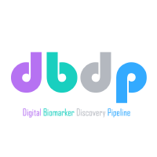

# Welcome to RAPIDS documentation

Reproducible Analysis Pipeline for Data Streams (RAPIDS) allows you to process smartphone and wearable data to [extract](features/feature-introduction.md) and [create](features/add-new-features.md) **behavioral features** (a.k.a. digital biomarkers), [visualize](visualizations/data-quality-visualizations.md) mobile sensor data, and [structure](analysis/complete-workflow-example.md) your analysis into reproducible workflows. Check out our [paper](https://www.frontiersin.org/article/10.3389/fdgth.2021.769823)!

RAPIDS is open source, documented, multi-platform, modular, tested, and reproducible. At the moment, we support [data streams](datastreams/data-streams-introduction) logged by smartphones, Fitbit wearables, and Empatica wearables (the latter in collaboration with the [DBDP](https://dbdp.org/)). 

!!! tip "Where do I start?"

    :material-power-standby: New to RAPIDS? Check our [Overview + FAQ](setup/overview/) and [minimal example](analysis/minimal)

    :material-play-speed: [Install](setup/installation), [configure](setup/configuration), and [execute](setup/execution) RAPIDS to [extract](features/feature-introduction.md) and [plot](visualizations/data-quality-visualizations.md) behavioral features

    :material-github: Bugs should be reported on [Github issues](https://github.com/carissalow/rapids/issues)

    :fontawesome-solid-tasks: Questions, discussions, feature requests, and feedback can be posted on our [Github discussions](https://github.com/carissalow/rapids/discussions)

    :material-twitter: Keep up to date with our [Twitter feed](https://twitter.com/RAPIDS_Science) or [Slack channel](http://awareframework.com:3000/)

    :material-plus-network: Do you want to modify or add new functionality to RAPIDS? Check our [contributing guide](./contributing)

    :fontawesome-solid-sync-alt: Are you upgrading from RAPIDS `0.4.x` or older? Follow this [guide](migrating-from-old-versions)

## What are the benefits of using RAPIDS?

1. **Consistent analysis**. Every participant sensor dataset is analyzed in the same way and isolated from each other.
2. **Efficient analysis**. Every analysis step is executed only once. Whenever your data or configuration changes, only the affected files are updated.
5. **Parallel execution**. Thanks to [Snakemake](https://snakemake.github.io/), your analysis can be executed over multiple cores without changing your code.
6. **Code-free features**. Extract any of the behavioral features offered by RAPIDS without writing any code.
7. **Extensible code**. You can easily add your own data streams or behavioral features in R or Python, share them with the community, and keep authorship and citations.
8. **Time zone aware**. Your data is adjusted to one or more time zones per participant.
9. **Flexible time segments**. You can extract behavioral features on time windows of any length (e.g., 5 minutes, 3 hours, 2 days), on every day or particular days (e.g., weekends, Mondays, the 1st of each month, etc.), or around events of interest (e.g., surveys or clinical relapses).
10. **Tested code**. We are continually adding tests to make sure our behavioral features are correct.
11. **Reproducible code**. If you structure your analysis within RAPIDS, you can be sure your code will run in other computers as intended, thanks to R and Python virtual environments. You can share your analysis code along with your publications without any overhead.
12. **Private**. All your data is processed locally.

## Users and Contributors

??? quote "Community Contributors"
    Many thanks to the [whole team](./team) and our community contributions:

    - Agam Kumar (CMU)
    - Yasaman S. Sefidgar (University of Washington)
    - Joe Kim (Duke University)
    - Brinnae Bent (Duke University)
    - Stephen Price (CMU)
    - Neil Singh (University of Virginia)

    Many thanks to the researchers that made [their work](./citation) open source:

    - Panda et al. [paper](https://pubmed.ncbi.nlm.nih.gov/31657854/)
    - Stachl et al. [paper](https://www.pnas.org/content/117/30/17680)
    - Doryab et al. [paper](https://arxiv.org/abs/1812.10394)
    - Barnett et al. [paper](https://doi.org/10.1093/biostatistics/kxy059)
    - Canzian et al. [paper](https://doi.org/10.1145/2750858.2805845)

??? quote "Publications using RAPIDS"
    - Mood ratings and digital biomarkers from smartphone and wearable data differentiates and predicts depression status: A longitudinal data analysis [link](https://doi.org/10.1016/j.pmcj.2022.101621)
    - Predicting Symptoms of Depression and Anxiety Using Smartphone and Wearable Data [link](https://www.frontiersin.org/articles/10.3389/fpsyt.2021.625247/full)
    - Predicting Depression from Smartphone Behavioral Markers Using Machine Learning Methods, Hyperparameter Optimization, and Feature Importance Analysis: Exploratory Study [link](https://mhealth.jmir.org/2021/7/e26540)
    -  Digital Biomarkers of Symptom Burden Self-Reported by Perioperative Patients Undergoing Pancreatic Surgery: Prospective Longitudinal Study [link](https://cancer.jmir.org/2021/2/e27975/)
    - An Automated Machine Learning Pipeline for Monitoring and Forecasting Mobile Health Data [link](https://ieeexplore.ieee.org/abstract/document/9483755/)
    - Mobile Footprinting: Linking Individual Distinctiveness in Mobility Patterns to Mood, Sleep, and Brain Functional Connectivity [link](https://www.biorxiv.org/content/10.1101/2021.05.17.444568v1.abstract)

