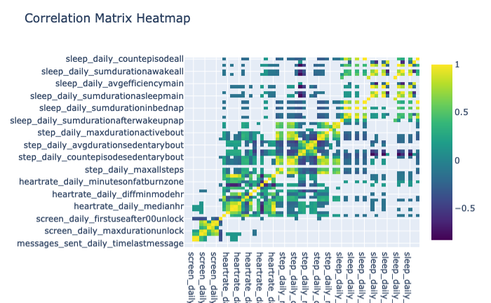

.. _heatmap-of-correlation-matrix-between-features

Heatmap of correlation matrix between features
==============================================

See `Heatmap of Correlation Matrix Config Code`_

**Rule Chain:**

- Rules to extract features
- Rule: ``rules/preprocessing.smk/download_dataset``
- Rule: ``rules/preprocessing.smk/readable_datetime``
- Rule: ``rules/preprocessing.smk/phone_sensed_bins``
- Rule: ``rules/preprocessing.smk/phone_valid_sensed_days``
- Rule: ``rules/reports.smk/heatmap_features_correlations``

.. _figure5-parameters:

**Parameters of heatmap_features_correlations Rule:**

=======================    ==============
Name                       Description
=======================    ==============
plot                       Whether the rule is executed or not. The available options are ``True`` and ``False``.
min_valid_hours_per_day    The minimum valid hours per day.
min_valid_bins_per_hour    The minimum valid bins per hour.
corr_method                Method of correlation. The available options are ``pearson``, ``kendall`` and ``spearman``.
min_rows_ratio             Minimum number of observations required per pair of columns to have a valid correlation coefient. Currently, only available for ``pearson`` and ``spearman`` correlation.
phone_features             The list of phone features.
fitbit_features            The list of Fitbit features.
corr_threshold             Only correlation coefficients larger than ``corr_threshold`` can be shown in the heatmap.
=======================    ==============

**Observations:**

Columns and rows are features computed in RAPIDS, cells’ color represents the correlation coefficient between all days of data for every pair of feature of all participants. The user can specify a minimum number of observations required to compute the correlation between two features using the ``MIN_ROWS_RATIO`` parameter (0.5 by default). In addition, this plot can be configured to only display correlation coefficients above a threshold using the ``CORR_THRESHOLD`` parameter (0.1 by default). See Figure 5.

    Figure 5 Correlation matrix heatmap for all the data of all participants

.. _`Heatmap of Correlation Matrix Config Code`: https://github.com/carissalow/rapids/blob/master/config.yaml#L211
