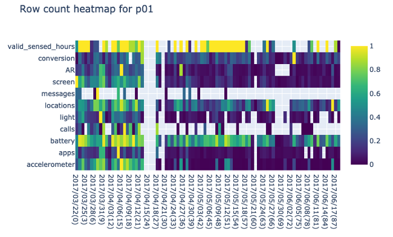

.. _heatmap-of-days-by-sensors

Heatmap of days by sensors
==========================

See `Heatmap of Days by Sensors Config Code`_

**Rule Chain:**

- Rule: ``rules/preprocessing.smk/download_dataset``
- Rule: ``rules/preprocessing.smk/readable_datetime``
- Rule: ``rules/preprocessing.smk/phone_sensed_bins``
- Rule: ``rules/preprocessing.smk/phone_valid_sensed_days``
- Rule: ``rules/reports.smk/heatmap_days_by_sensors``

.. _figure3-parameters:

**Parameters of heatmap_days_by_sensors Rule:**

=======================    =======================
Name                       Description
=======================    =======================
plot                       Whether the rule is executed or not. The available options are ``True`` and ``False``.
min_valid_hours_per_day    The minimum valid hours per day.
min_valid_bins_per_hour    The minimum valid bins per hour.
expected_num_of_days       The number of days of data to show starting from the first day of each participant.
db_tables                  List of sensor tables to compute valid bins & hours.
=======================    =======================

**Observations:**

In this heatmap rows are sensors, columns are days and cells’ color shows the normalized (0 to 1) number of valid sensed hours (See valid sensed :ref:`bins<phone-valid-sensed-bins>` and :ref:`days<phone-valid-sensed-days>` sections) collected by a sensor during a day for a participant. The user can decide how many days of data to show starting from the first day of each participant. This plot can used to judge missing data on a per participant, per sensor basis as well as the number of valid sensed hours (usable data) for each day. See Figure 3.

    Figure 3 Heatmap of days by sensors for a participant

.. _`Heatmap of Days by Sensors Config Code`: https://github.com/carissalow/rapids/blob/master/config.yaml#L226
