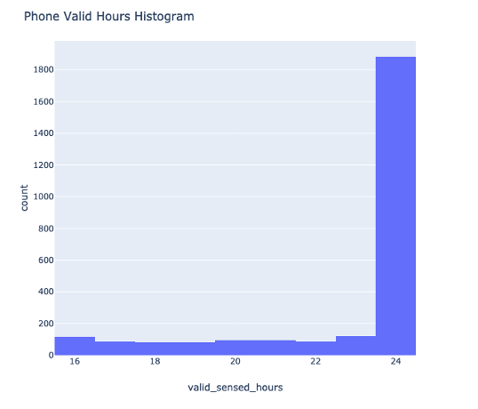

.. _histogram-of-valid-sensed-hours:

Histogram of valid sensed hours
===============================

See `Histogram of Valid Sensed Hours Config Code`_

**Rule Chain:**

- Rule: ``rules/preprocessing.smk/download_dataset``
- Rule: ``rules/preprocessing.smk/readable_datetime``
- Rule: ``rules/preprocessing.smk/phone_sensed_bins``
- Rule: ``rules/preprocessing.smk/phone_valid_sensed_days``
- Rule: ``rules/reports.smk/histogram_valid_sensed_hours``

.. _figure1-parameters:

**Parameters of histogram_valid_sensed_hours Rule:**

=======================    =======================
Name                       Description
=======================    =======================
plot                       Whether the rule is executed or not. The available options are ``True`` and ``False``.
min_valid_hours_per_day    The minimum valid hours per day.
min_valid_bins_per_hour    The minimum valid bins per hour.
=======================    =======================

**Observations:**

This histogram shows the valid sensed hours of all participants processed in RAPIDS (See valid sensed :ref:`bins<phone-valid-sensed-bins>` and :ref:`days<phone-valid-sensed-days>` sections). It can be used as a rough indication of the AWARE client monitoring coverage during a study for all participants. See Figure 1.

    Figure 1 Histogram of valid sensed hours for all participants

.. _`Histogram of Valid Sensed Hours Config Code`: https://github.com/carissalow/rapids/blob/master/config.yaml#L221
