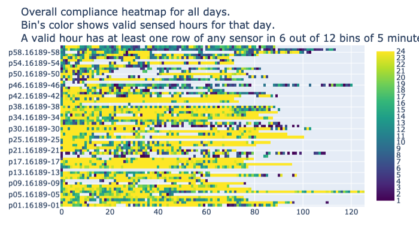

.. _overall-compliance-heatmap

Overall compliance heatmap
==========================

See `Overall Compliance Heatmap Config Code`_

**Rule Chain:**

- Rule: ``rules/preprocessing.smk/download_dataset``
- Rule: ``rules/preprocessing.smk/readable_datetime``
- Rule: ``rules/preprocessing.smk/phone_sensed_bins``
- Rule: ``rules/preprocessing.smk/phone_valid_sensed_days``
- Rule: ``rules/reports.smk/overall_compliance_heatmap``

.. _figure4-parameters:

**Parameters of overall_compliance_heatmap Rule:**

=======================    =======================
Name                       Description
=======================    =======================
plot                       Whether the rule is executed or not. The available options are ``True`` and ``False``.
only_show_valid_days       Whether the plot only shows valid days or not. The available options are ``True`` and ``False``.
expected_num_of_days       The number of days to show before today.
bin_size                   Every hour is divided into N bins of size ``BIN_SIZE`` (in minutes).
min_valid_hours_per_day    The minimum valid hours per day.
min_valid_bins_per_hour    The minimum valid bins per hour.
=======================    =======================

**Observations:**

In this heatmap rows are participants, columns are days and cells’ color shows the valid sensed hours for a participant during a day (See valid sensed :ref:`bins<phone-valid-sensed-bins>` and :ref:`days<phone-valid-sensed-days>` sections). This plot can be configured to show a certain number of days before today using the ``EXPECTED_NUM_OF_DAYS`` parameter (by default -1 showing all days for every participant). As different participants might join the study on different dates, the x-axis has a day index instead of a date. This plot gives the user a quick overview of the amount of data collected per person and is complementary to the histogram of valid sensed hours as it is broken down per participant and per day. See Figure 4.

    Figure 4 Overall compliance heatmap for all participants

.. _`Overall Compliance Heatmap Config Code`: https://github.com/carissalow/rapids/blob/master/config.yaml#L237
