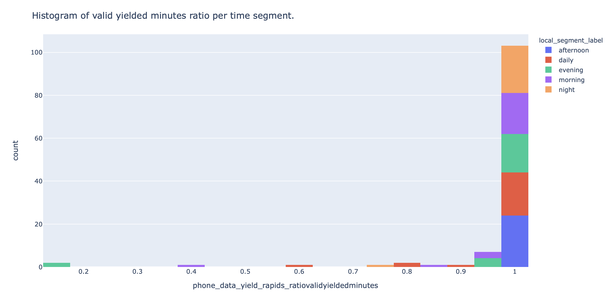
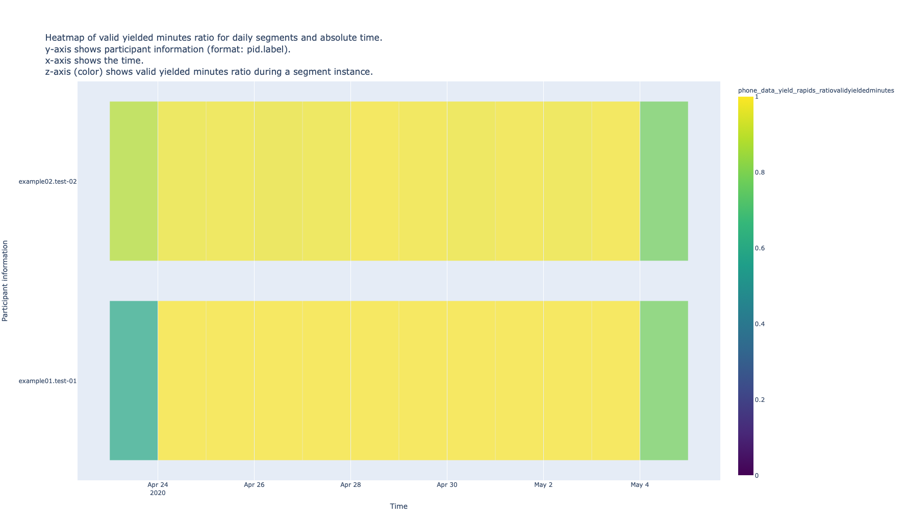
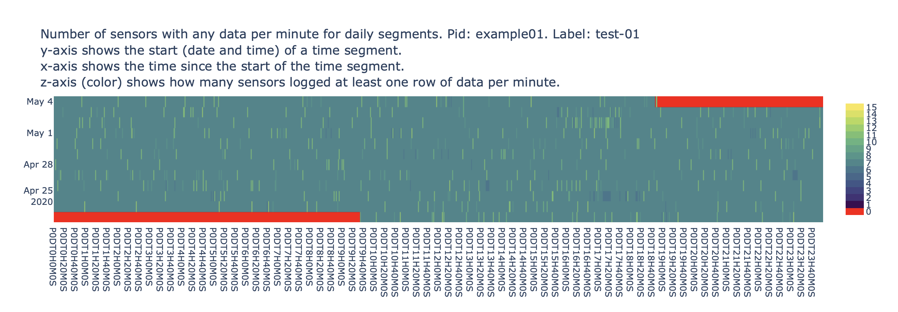
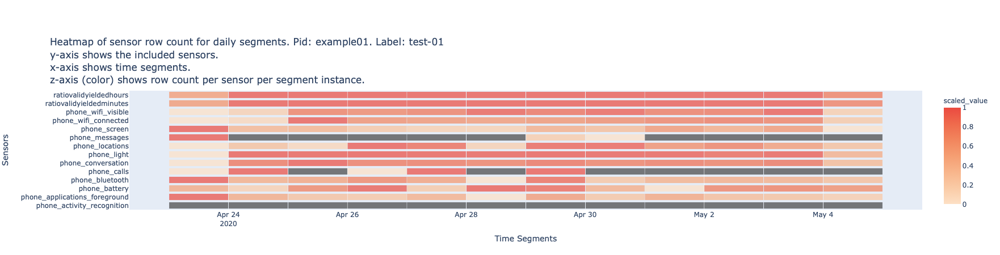

# Data Quality Visualizations
We showcase these visualizations with a test study that collected 14 days of smartphone and Fitbit data from two participants (example01 and example02) and extracted behavioral features within five time segments (daily, morning, afternoon, evening, and night).

!!! note
    [Time segments](../../setup/configuration#time-segments) (e.g. `daily`, `morning`, etc.) can have multiple instances (day 1, day 2, or morning 1, morning 2, etc.)

## 1. Histograms of phone data yield
RAPIDS provides two histograms that show the number of time segment instances that had a certain ratio of valid [yielded minutes and hours](../../features/phone-data-yield/#rapids-provider), respectively. A valid yielded minute has at least 1 row of data from any smartphone sensor and a valid yielded hour contains at least M valid minutes.

These plots can be used as a rough indication of the smartphone monitoring coverage during a study aggregated across all participants. For example, the figure below shows a valid yielded minutes histogram for daily segments and we can infer that the monitoring coverage was very good since almost all segments contain at least 90 to 100% of the expected sensed minutes.

!!! example
    Click [here](../../img/h-data-yield.html) to see an example of these interactive visualizations in HTML format

<figure>
  
  <figcaption>Histogram of the data yielded minute ratio for a single participant during five time segments (daily, morning, afternoon, evening, and night)</figcaption>
</figure>

## 2. Heatmaps of overall data yield
These heatmaps are a break down per time segment and per participant of [Visualization 1](#1-histograms-of-phone-data-yield). Heatmap's rows represent participants, columns represent time segment instances and the cells’ color represent the valid yielded minute or hour ratio for a participant during a time segment instance.

As different participants might join a study on different dates and time segments can be of any length and start on any day, the x-axis can be labelled with the absolute time of each time segment instance or the time delta between each time segment instance and the start of the first instance for each participant. These plots provide a quick study overview of the monitoring coverage per person and per time segment.

The figure below shows the heatmap of the valid yielded minute ratio for participants example01 and example02 on daily segments and, as we inferred from the previous histogram, the lighter (yellow) color on most time segment instances (cells) indicate both phones sensed data without interruptions for most days (except for the first and last ones).

=== "[ABSOLUTE_TIME]"

    !!! example
        Click [here](../../img/hm-data-yield-participants-absolute-time.html) to see an example of these interactive visualizations in HTML format

    <figure>
      
      <figcaption>Overall compliance heatmap for all participants</figcaption>
    </figure>

=== "[RELATIVE_TIME]"

    !!! example
        Click [here](../../img/hm-data-yield-participants-relative-time.html) to see an example of these interactive visualizations in HTML format

    <figure>
      
      <figcaption>Overall compliance heatmap for all participants</figcaption>
    </figure>

## 3. Heatmap of recorded phone sensors

In these heatmaps rows represent time segment instances, columns represent minutes since the start of a time segment instance, and cells’ color shows the number of phone sensors that logged at least one row of data during those 1-minute windows. 

RAPIDS creates a plot per participant and per time segment and can be used as a rough indication of whether time-based sensors were following their sensing schedule (e.g. if location was being sensed every 2 minutes).

The figure below shows this heatmap for phone sensors collected by participant example01 in daily time segments from Apr 23rd 2020 to May 4th 2020. We can infer that for most of the monitoring time, the participant’s phone logged data from at least 7 sensors each minute.
 
!!! example
    Click [here](../../img/hm-phone-sensors.html) to see an example of these interactive visualizations in HTML format

 <figure>
  
  <figcaption>Heatmap of the recorded phone sensors per minute and per time segment of a single participant</figcaption>
</figure>

## 4. Heatmap of sensor row count
These heatmaps are a per-sensor breakdown of [Visualization 1](#1-histograms-of-phone-data-yield) and [Visualization 2](#2-heatmaps-of-overall-data-yield). Note that the second row (ratio of valid yielded minutes) of this heatmap matches the respective participant (bottom) row the screenshot in Visualization 2.

In these heatmaps rows represent phone or Fitbit sensors, columns represent time segment instances and cell’s color shows the normalized (0 to 1) row count of each sensor within a time segment instance. A grey cell represents missing data in that time segment instance. RAPIDS creates one heatmap per participant and they can be used to judge missing data on a per participant and per sensor basis.

The figure below shows data for 14 phone sensors (including data yield) of example01’s daily segments. From the top two rows, we can see that the phone was sensing data for most of the monitoring period (as suggested by Figure 3 and Figure 4). We can also infer how phone usage influenced the different sensor streams; there are peaks of screen events during the first day (Apr 23rd), peaks of location coordinates on Apr 26th and Apr 30th, and no sent or received SMS except for Apr 23rd, Apr 29th and Apr 30th (unlabeled row between screen and locations).

!!! example
    Click [here](../../img/hm-sensor-rows.html) to see an example of these interactive visualizations in HTML format

 <figure>
  
  <figcaption>Heatmap of the sensor row count per time segment of a single participant</figcaption>
</figure>
