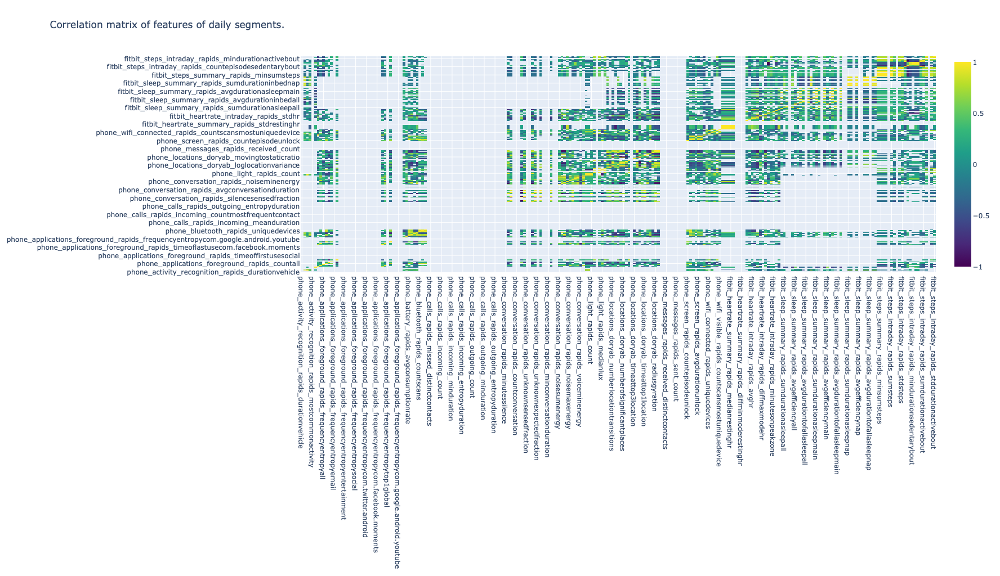

# Feature Visualizations

## 1. Heatmap Correlation Matrix
Columns and rows are the behavioral features computed in RAPIDS, cells’ color represents the correlation coefficient between all days of data for every pair of features of all participants. 

The user can specify a minimum number of observations ([time segment](../../setup/configuration#time-segments) instances) required to compute the correlation between two features using the `MIN_ROWS_RATIO` parameter (0.5 by default) and the correlation method (Pearson, Spearman or Kendall) with the `CORR_METHOD` parameter. In addition, this plot can be configured to only display correlation coefficients above a threshold using the `CORR_THRESHOLD` parameter (0.1 by default).

!!! example
    Click [here](../../img/hm-feature-correlations.html) to see an example of these interactive visualizations in HTML format

<figure>
  
  <figcaption>Correlation matrix heatmap for all the features of all participants</figcaption>
</figure>